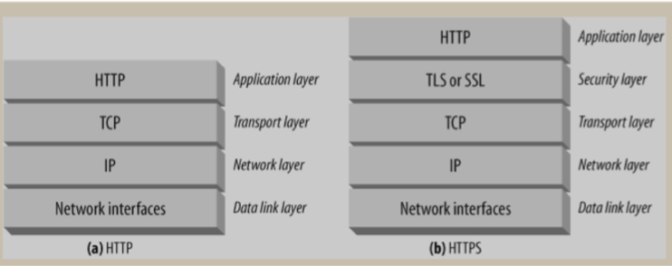
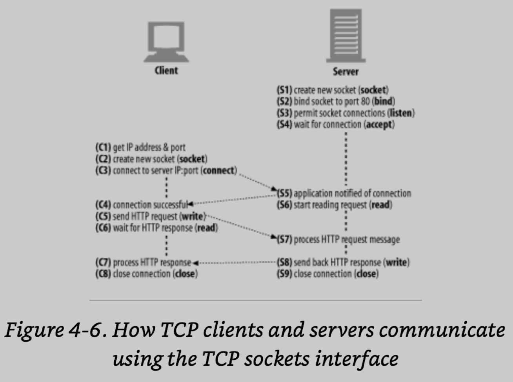
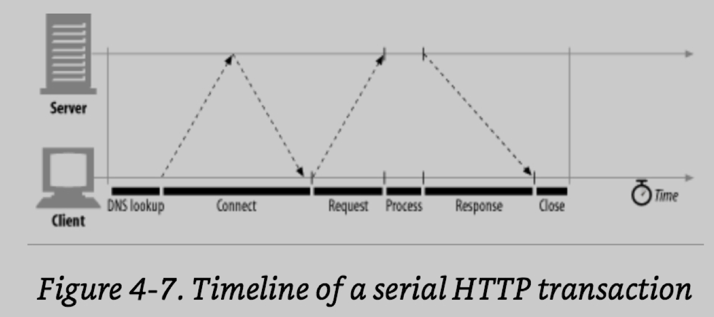
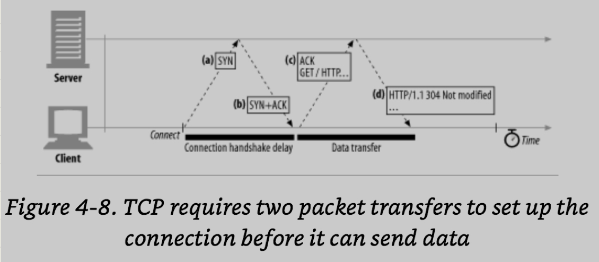
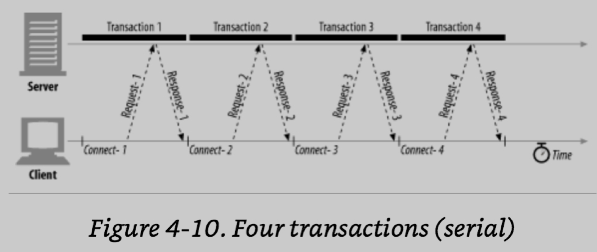

## Chapter 4. Connection Management

Http Message가 아닌 connection에 대해 다룬다.

HTTp가 TCP connection을 사용하는 방법 delay, 병목현상, clogs, http 최적화, parallel connection, keep alive, pipeline, Dos

Http는 TCP/IP를 통해 통신한다. client는 서버에 TCP/IP 통신을 열 수 있으며 일단 연결이 되고 나면 데이터를 잃어버리거나, 손상되거나, 바지못하는 일이 발생되지 않는다.

### Http 1 Transaction
- URL의 hostname에서 IP를 구하고 port를 추출하여 해당 서버를 알아낸다.
- Request를 보내고 Response를 받아와 browser에 보여준다.
- 연결을 끊는다.

### TCP - reliable data pipes

왜 TCP/IP를 공부해야할까? 에 대해 설명함.

Http는 TCP연결과 연결볍 그 이상도, 이하도 아니다. data를 빠르고 정확하게 보내기 위해 TCP 기본을 알아야 한다.

TCP Stream은 IP패킷으로 쪼개져 전송된다.

protocol stack에서 HTTP 최상단에 위치하며 보안 설정이 들어올 경우 HTTP와 TCP 사이에 TLS가 자리한다.

Http가 message를 전송하길 원할 때 TCP는 data stream을 잡아 segment 단위로 나누고 IP packet에 담아 전송한다.

- header: 20bytes
    - source와 목적지 정보, 사이즈, flag
- TCP segment header: 20 bytes
    - port 번호, TCP control flag, 숫자값(data 정렬, integrity checking)
- chunk of TCP data: 0 ~ more bytes

**이러한 과정을 TCP/IP software가 수행하며, programmer가 다루지 않는다.**

### Keeping TCP connection straight

port는 일종의 내선번호이다. IP주소는 정확한 서버의 위치를 알려주고 port는 올바른 application에 도달하게 한다.

즉, 하나의 서버엔 여러개 application을 작동시킬 수 있고, 그 여러개 작동중인 application에 정확히 연결하는덴 port가 필요하다.

### Programming with TCP sockets

OS는 각각 다른 TCP연결을 다루는 기능을 제공한다. socket API가 최초엔 unix programmer를 위해 개발되었지만, 현재는 HTTP 개발자들에게도 사용된다.
다음은 socket API인데, 이 interface를 제공하면서 상세한 기능은 모두 감추었다.

|Socket API call|description|
|----|----|
| s = socket(<parameters>) | 새로운 socket을 생성한다. |
| bind(s, <local IP:port>) | socket의 local port에 interface를 할당한다 |
| connect(s, <remote IP:port>) | local의 TCP 소켓과 원격 host, port에 연결한다. |
| listen(s, ...) | local의 socket을 connection accept로 설정한다. |
| s2 = accept | 누군가가 socket에 연결할 대기 상태를 생성한다. |
| n = read(s, buffer, n) | socket의 buffer를 n bytes 단위로 읽는다. |
| n = write(s, buffer, n) | socket 안에서 buffer에 n bytes 단위로 작성한다. |
| cloes(s) | TCP 연결을 끊는다. |
| shutdown(s, <side>) | input 혹은 output의 TCP 연결을 끊는다. |
| getsocopt(s, ...) | socket의 configuration 값을 읽어온다. |
| setsocket(s, ...) | socket의 configuration 값을 설정한다. |

socket API는 다른 서버에 TCP connection을 맺고 그 안에 읽기, 쓰기 등을 가능하게 한다. 이러한 TCP의 API는 hand shaking 하면서 나누고 조립하여 IP packet으로 만드는 과정을 캡슐화 한다.

1. clinet는 IP와 port로 요청 대상에 TCP 연결을 생성한다.
    - 서버가 얼마나 먼지, 인터넷이 얼마나 혼잡한지는 관계 없다.
2. TCP connection 이 열리면 request를 서버로 전송한다.
3. 서버는 요청을 읽는다.
4. 요청을 수행한다.
5. client에게 연산 결과를 작성해 반환한다.
6. client는 response를 읽고 수행한다.

### TCP Performace Considerations

HTTP는 TCP 바로 위에 존재하기 때문에 HTTP의 성능은 TCP의 영향을 받는다. TCP의 기본적인 특성을 이해하여 HTTP를 최적화한다.

transaction의 시간은 연결을 위해 설정하는 시간에 비해서 request와 response의 시간이 더 짧을 수 있다.

client난 server가 과부하 되거나 복잡한 resource를 실행시키지 않는 한 대부분의 delay는 TCP connection이 성능 하락의 원인인다.

### Performance Focus Area

HTTP 성능중 TCP와 연계하여 성능에 영향을 주는 지점은 다음과 같다.

1. TCP connection 생성시 필요한 handshake
2. TCP의 slow start
3. data 전송을 하는 Nagle's Algorithm
4. TCP's delayed acknowledgement algorithm for piggybacked acknowledgements
5. TIME_WAIT delays and port exhuation.

### TCP Connection Handshake Delays

TCP는 data를 주고받기 전에 packet을 교환하는데 아주 작은 data라 하더라도 이 packet 교환이 반드시 선행된다.(handshake) 그리고 이 과정이 HTTP 성능 저하에 큰 원인이 된다.

1. SYN: 새로운 request를 위해 TCP ㅇ녀결을 하면 client는 40~60 bytes를 서버로 전송하고, 이 packet은 'SYN' 이라는 flag를 전송한다.
2. SYN + ACK: 서버는 connection을 허가하면 응답으로 SYN에 ACK라는 flag를 붙여 client로 반환한다.
3. ACK: client는 SYN, ACK를 받으면 서버로 ACK를 보내는데, 이는 connection이 성공적으로 맺어짐을 의미한다.

이러한 TCP setup이 목적인 handshake 과정이 http transaction 과정에서 50% 이상을 차지한다.

### Delay Acknowledgement

인터넷 자체는 패킷 전송에 대해 신뢰성을 보장하지 않는다. (overload시 packet을 파괴한다.) TCP는 이 단점을 보완하여 성공적인 전송을 보장한다.

- TCP segment는 sequencial한 number를 부여받고 data checksum을 가져 신뢰성을 갖는다.
- client의 요청을 받은 수신 서버는 ACK를 전송한다.
- 서버가 ACK를 다시 받지 못한다면 packet이 파괴된 것으로 간주하여 data를 재전송한다.

ACK는 용량이 작기 때문에 TCP가 outgoing data를 포함해 전송할 수 있다.

ACK가 data packet을 찾을 확률을 높히기 위해 같은방향으로 위치 시키며, 많은 TCP가 "Delay Acknowledgement" 알고리즘을 구현했다.

이 "Delay Acknowledgement" 알고리즘은 100~200 milliseconds에 piggyback을할 outgoing data를 찾고, 나가는 data가 도착하지 않는다면 ACK는 자신의 packet을 전송한다.

### Slow Start

TCP의 data 전송 성능은 TCP 연결 age에 달려있다. TCP connection의 "tune"은 시간이 흐르면 maximum speed를 제한하여 overloading을 낮추고 인터넷의 혼재를 줄이는데 이를 slow start라 한다.

Slow Start는 TCP가 한번에 전송하는 패킷의 수(count)를 제한한다. packet을 성공적으로 받은 뒤 2개 이상의 패킷을 전송할 권한을 얻는다.
(하나의 packet을 전송하고 기다려 ACK를 받고, 2개의 packet을 전송하고 ACK를 받은 뒤 4개의 packet을 보내는 방식이다.)

이러한 conjestion 통제 기능 덕분에 새로운 connection은 "tune" 된 connection 보다 느리다.

"tuned" 연결은 빠르기 때문에 연결을 재사용하는 기능이 포함되어 있다.

### Nagle's Algorithm and TCP_NODELAY

TCP는 어떤 size의 data라도 stream하여 전송하는 기능이 있다. 그러나 TCP는 40bytes의 flags, headers를 전송하기 때문에 많은 packet에 적은 data를 포함해 전송하면 성능에 악영향을 미치게된다.

이에 Nagle은 많은양의 data를 bundle로 묶어 전송하는것을 시도한다. packet이 1,500bytes가 최고치 일 때 최고치에 도달하지 않는다면, 전송을 막는 알고리즘이다.

만약 다른 부분의 data가 이동중이라면, 남은 부분은 buffered 되고, buffered data가 전송되려면 충분히 전송할 data가 추적되거나, ACK 과정을 거친다.

#### 그러나 Nagle's Algorithm은 성능상 치명적인 부분이 있다.

1. message 크기가 작고, 다음 data가 전송되지 않는다.
2. 이 알고리즘은 ACK와 상호작용하지 않는다. 지연으로 100~200 millisecond가 발생한다.

이러한 이유로 HTTP app에서 성능향상을 목적으로 Nagle's Algorithm을 TCP_NOREPLY param을 두어 설정단계에서 disabled 하기도 한다.

### TIME_WAIT Accumulation and Port Exhaustion

TCP가 연결을 끊을 때, IP와 port등의 정보를 잠시동안 메모리에 유지한다. 이 사이클은 약 2분 정도 지속되어 "2MSL"이라 칭한다. 이 시간동안 동일한 IP와 port에 TCP connection이 생성되지 않는다. 이러한 로직은 중복 data가 우연히 같은 곳으로 전송되는 사고를 예방한다.

packet이 복제되고, 과거 중복 data가 새롱누 stream으로 삽입되면 TCP data는 손상된다.

2MSL 연결로 발생된 지연이 그리 큰 문제는 아니지만, benchmarking situation에선 이야기가 다르다. 일반적으로 하나 혹은 이상의 컴퓨터가 client에서 서버로 접속하는 갯수를 제한한다. 일반적으로 서버는 80 port로 listening을 하고 있으며, 이러한 환경에서 TIME_WATI에 의해 재사용 조합이 차단될 수 있다.

매시간 client는 서버에 연결하면서 unique함을 지키기 위해 새로운 source port를 할당받는데, 약 6만개 이다. 2MSL에 의해 2분마다 재사용이 가능하니 한번에 맺는 connection 수는 약 500개에 해당한다.

#### 해결책

은 TIME_WAIT port Exhaustion을 쓰지않고, client는 load-generator machine이나 virutal IP 주소를 추가해 connection의 갯수를 확보하자.

만약 아직 이러한 문제를 겪지 않았더라도 open connections의 갯수가 늘어남녀서 특정 OS에는 극단적인 문제를 일으킬 수 있으니 주의애야 한다.

### HTTP Connection Handling

- manipulating and optimizing connections

The oft-Misunderstood Connection Header

HTTP는 client와 origin 서버 사이에 chain 사용을 허가한다. 몇 가지 경우에 HTTP 앱은 인접한 연결을 공유하는 서버에 option을 적용해야 할 때가 있다. 

HTTP message는 server -> proxy -> server 식으로 전송 될 때 message 자체는 복사되어 fw되어야 하지만, header에 있는 정보들은 삭제되어야 한다. 이 header는 comma에 의해 분리되어 있는데 connection: close에 의해 message가 전송되고 나서 명시되어야 한다. 그러나 3종류의 type이 다른 token은 혼돈의 소지가 있다.

-  HTTP header field name, listening header relevant for only this connection
-  임의의 token값, 이 연결에 대한 비표준 option 
-  close값, 끝났을 때 persistent 연결의 종료값.

### Serial Transaction Delay

TCP 성능은 이해와 관련 지식이 중요하다. HTML에 image가 3개 embedded 라면 browser가 각각에 대해 새로운 connection을 맺을때 순차적으로 맺는다면 slow start가 일어난다.

이미지 하나가 load 되고 다른 변화가 없다면 user는 심리적으로 이상하게 생각할 수 있다. 따라서 이미지는 같은 시간에 여러개 load 시키는게 좋다.

특정 browser에서는 object가 충분히 load되기 전에는 보여줄 수 없기 때문에 serial transaction에 적합하지 않다. 왜냐하면 object의 size를 알아야 하는데 이것은 load 되야 알 수 있기 때문이다.

이에 대응하기 위핸 TCP connection 들은 다음과 같다.

1.  Parallel connections: 현재 HTTP request를 여러개 연결한다.
2.  Persistent Connections: TCP connections의 연결과 종료 지연시간을 측정해 재사용한다.
3. Pipelinedd Connections: 현재의 TCP connection을 공유하여 연결한다.
4. Multiplexed Connections: request와 response chunk 사이에 공백을 끼워넣는다.

