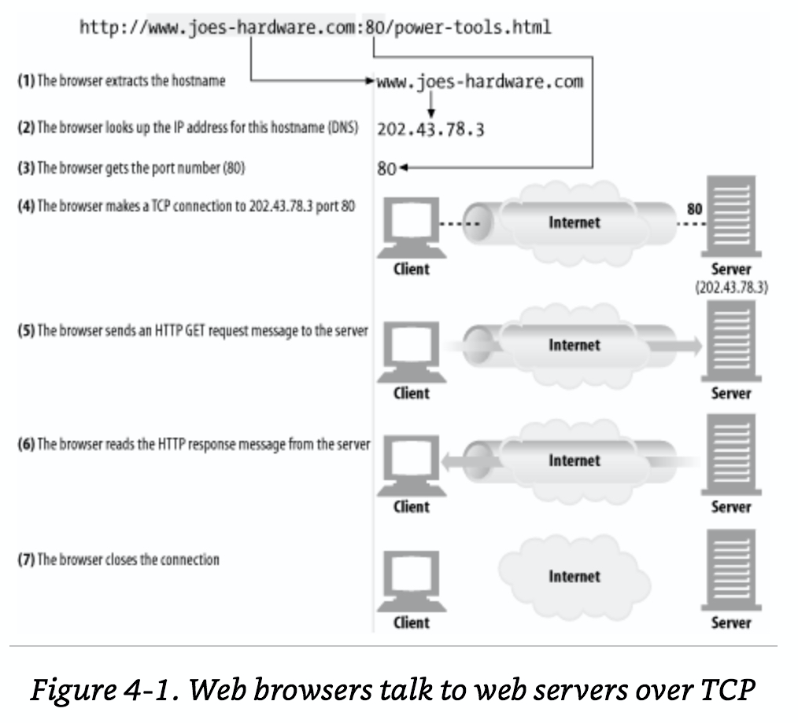
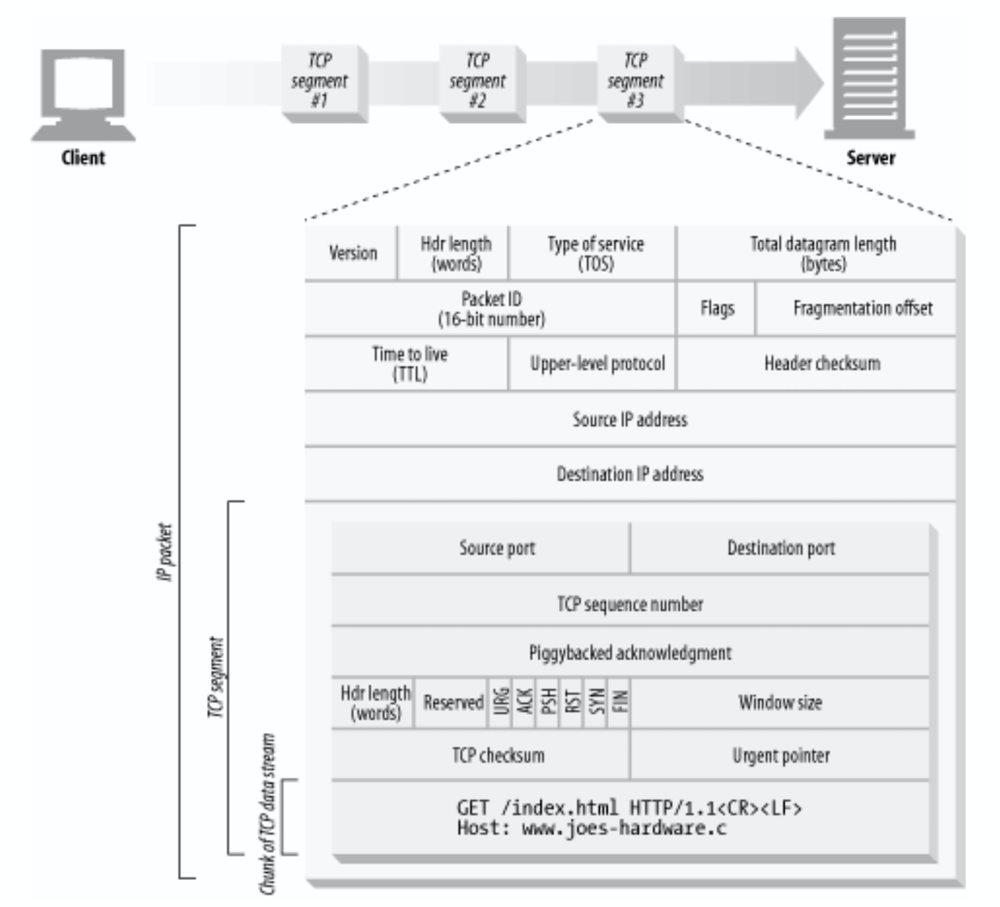
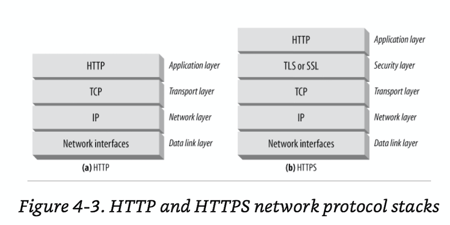
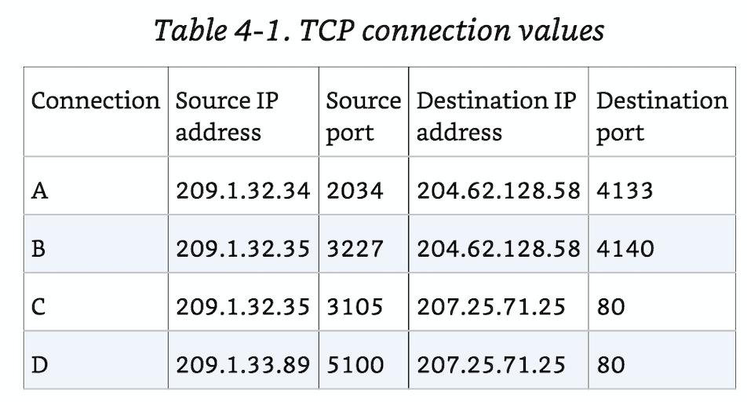
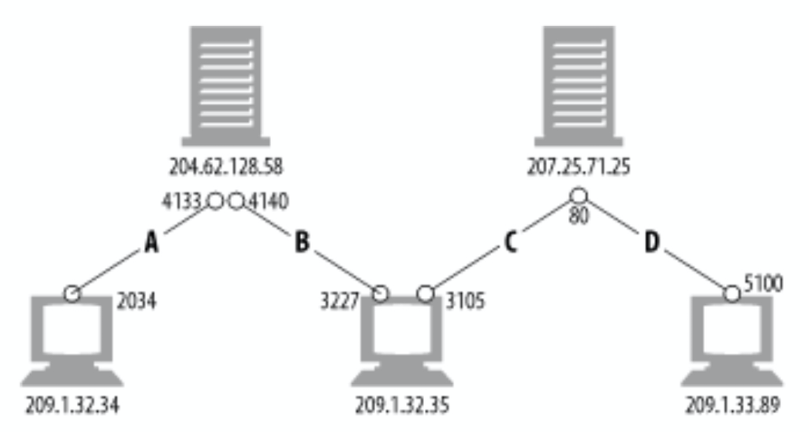

# Chapter4. Connection Management

HTTP 특징으로는 HTTP는 제법 편하게 설명이 잘 되어있다. 하지만 HTTP conenction에 대해서는 자세히 언급하지 않는다. 참 웃기는일이다. 비 연결형 통신인 HTTP는 L4의 연결형 통신 TCP를 기반으로 데이터손실 없는 서비스를 제공하고 있으니 말이다. 이 챕터는 이 부분에 대해서 자세히 diving할 것이다.

#### 전제

여기에서 말하는 HTTP connection에 관련된 성능이 후진 이슈에 대해 언급한것은 최근의 HTTP application이 가지고 있던 성능문제가 아닌, 이 전의 것들에 대해서 언급한것이다. 물론 최근의 것들도 부분 그럴 수 있지만, 전제가 최신의 HTTP Application에 대한 내용이 아니란것만 알아두자.

#### 알아볼 것

- HTTP는 어떻게 TCP connection을 사용할까?
- TCP 커넥션의 지연(Delays), 병목(Bottlenecks) 그리고 (끊킴)clogs
- Parallels(병렬), Keep-Alive(연결 유지), Pipelined connection이 있는 HTTP의 최적화 작업
- Dos(해야 하는 것들) and don'ts(하면 안되는 것들) for managing connection

#### 양해의 말

TCP network에 대해서 공부했지만 가물가물하기 때문에 TCP부분은 가급적 자세하고 이해하기 좋게 설명하기위해 장문으로 작성했다. 이점 유념해두길..

# TCP Connection
a.k.a HTTP는 TCP/IP를 이용한다. 유명한 packet-switched 네트워크 프로토콜의 layered된 TCP/IP를 통해 network의 device들이랑 대화한다. 

1. 브라우저는 URL로 hostname을 받는다.
2. DNS를 이용하여 URL에 있는 domain네임을 이용해 IP주소를 추출한다.
3. URL에 적힌 scheme, 프로토콜로 인한 default port를 예상하거나 아니면 기술된 port number를 획득한다.
4. URL을 이용해 얻은 단서로 IP:port를 만들어 remote host에 연결을 맺는다.
5. 연결을 맺은 후 URL에 있는 사용자가 요청하려는 정보를 전달한다. 아마 GET일거임.
6. 요청을 처리한 서버는 클라이언트(정보 요청자)가 기술한 URL의 내용대로 응답(response)한다.
7. 하나의 트랜젝션(요청과 응답)이 끝나면 클라이언트의 머신인 브라우저는 연결을 종료한다.

### TCP Reliable Data Pipes

(TCP는 신뢰있는 데이터 파이프 이다.)

TCP를 이용하기 때문에 신뢰있는 데이터를 전송할 수 있고, TCP는 데이터를 segment단위로 나눠 pipe 전송할 수 있는 스펙이 있다.

### TCP Streams Are Segmented and Shipped By IP Packets
TCP streams들은 segment된 상태로 IP패킷에 감싸져 운반된다.

TCPe데이어들은 작은 단위로 chunk되어있다. 그리고 이것들이 한 단계 더 낮은 layer인 3계층의 IP프로토콜의 패킷이 된다. 이것을 IP datagram이라 한다.

HTTP에서의 트랜젝션은 TCP를 통해 데이터가 스트림으로 전송되게 된다. application 개발하면서는 한번에 전송되고 한번에 오는것 처럼 보였겠지만, 이 데이터들은 여러번 스트림으로써 전송되는것이었다. 스트림으로 여러번 송수신되는데 이렇게 여러번 전송되면서 잘리게 되는것을(chunked) 이를 segment라고 한다.

각각의 TCP segment는 IP packet에 의해 전송된다. 하나의 IP Addr.에서 다른 IP Addr.로 데이터를 전송할때 패킷에는 다음과 같은 패킷헤더를 갖게 된다.

> IP Packet Header(at least, 40 or more bytes) =
>                 (TCP Data 0 or more bytes) + 
>                 (TCP Header, usually 20 bytes) +
>                 (IP Header, usually 20 bytes)

> TIPS1: 토막상식이지만 L4 IP에서는 송수신 될 데이터를 datagram 또는 packet이라 부른다. L3 TCP에서는 송수신 될 데이터를 segment라고 부른다.
> TIPS2: TLS/SSL은 TCP와 HTTP사이에 존재하여 터널링을 해주는 보안 프로토콜이다. 그렇다고 TLS/SSL이 정확히 어떤 레이어에 속한다라고 할 수 없다. 애초에 OSI 7 layer도 그러니까..(기준이 애매한 부분이 있음) 그리고 왜 속한다 할 수 없냐면, OSI 7 layer기준으로 하나의 레이어역할만 수행하는것이 아니기 때문. 그러니까.. 4567레이어 라고 할 수 도 있고.. 56이라고 할수 있고.. 뭐.. 무튼 모호하다. 무튼 저 사이에 있다고만 알고있자.

### Keeping TCP Connections Straight

컴퓨터는 다른 호스트와의 TCP 통신을 할때에 'Connection'이란것을 한번 만들어 낸다. 이것은 하나의 port number를 이용해 만든것이며 다음과 같은 4가지의 값을 가지고 있다.

> {source IP address} {source port} {destination IP address} {destination port}

이 4개의 조합값으로 커넥션을 맺으며 2개 이상의 다른 TCP connection 들은 4개의 값을 이용해 만들기 때문에 서로 같은 값을 가진 커넥션은 존재하지 않게 된다. (전제가 remote 와 origin host의 port를 하나씩 이용하기 때문)

> TIP: 때로는 destination쪽이라던지 source쪽의 IP와 port를 같은걸 사용 할 수 도 있다.

컴퓨터는 아마 한 번에 여러개의 TCP Connection을 맺고있을 지도 모른다. TCP는 이 모든 연결들을 한 번에 port numbers 개수만큼 유지시키고 있을것이다. 

> TIPS1: 한 컴퓨터의 최대 연결 가능한 TCP커넥션의 개수는 포트 최대 개수 65532개가 고정은 아니다. 알아둬야 할 것이 몇몇의 커넥션 같은 경우는 자기는 하나의 포트만 열었지만 서로 다른 복수개의 목적포트를 바라볼 수 도 있다. 즉, TCP의 연결은 포트 수 만큼 제한이 있는것이 아니란 이야기 이다. 이런것이 되는것은 connection이 서로 다른 목적 port에 대해서 connection을 share(공유)상태가 되었기 때문이다.

### Programming with TCP Sockets

> socket = connection on TCP | maybe :)

반드시 알아야할 부분이 있다. 서로 다른 운영체제에서는 TCP Connection에 대한 서로 다른 스펙을 가지고 있다. 때문에 Connection을 제어하는데에도 필요한 Interface들의 내용(kernel 및 system call영역)이 다르다. 이것은 같은 운영체제라 하더라도 버전마다 다를 수 있는 부분이다.

그러한 점을 고려해서 운영체제는 TCP Connection을 프로그래밍으로 다룰 수 있는 API를 제공하며, HTTP Application을 프로그래밍 하는데에 있어 HTTP Programmer는 이에 대해서 몰라도 될 정도의 고 수준의 HTTP API를 제공한다. 심지어 TCP가 어떤 handshaking이 필요한지, 어떤 방식의 segmentation이 필요한지, 그리고 segemented dataframe들을 어떻게 재 조합하면 되는지에 대한 이해도 필요 없을 정도의 TCP 통신 기반의 HTTP API를 제공한다.

# TCP Performance Considerations
TCP 성능에 대한 고려
HTTP의 layer는 직접적으로 TCP위에 올려져있다. 그렇기 때문에 HTTP의 통신(트렌젝션transaction) 은 결정적으로 TCP Plumbling(성능 평가)에 달려있다.

이 section은 TCP 연결에 있어 중요한 성능 고려사항들에 대해 이야기를 하며 HTTP connection에 대한 뽕에 취할 예정이다.

### HTTP Transaction Delays

우리 알고 있는 지식을 기본으로 HTTP의 트랜젝션 한번당 TCP 연결을 맺었다가 끊는다. 하지만 우리는 html의 페이지를 로드할때 하나의 resource만 호출하지 않는다. 보통 n개 이상의 데이터를 호출한다. 그렇다면 TCP의 연결은 n번 발생하게 되고 TCP에서 필연적인 handshake과정이 필요하게 될 것이다.

즉, n개의 resouce를 불러올 때 HTTP Transaction 개수만큼 TCP의 handshake가 발생하게 될 것이다. (SYN 그리고 SYN, ACK의 환장파티..)

그리고 너무나도 당연하게 우리는 앞서 읽었던것 처럼 URL주소에 있는 IP주소를 찾기위해 DNS를 이용해 IP주소를 찾아야하는 짓거리를 n번 해야한다. 이미 알고있는데도 말이다.

정리해보자면..

> 이... n번의 DNS를 이용한 IP주소 찾기 그리고 TCP handshake 필요한가?

책에 기술된 바에 의하면 위 과정들만 줄여도 50%이상의 낭비되는 시간을 줄여 성능을 높일 수 있다고 한다. 지금은 HTTP와 TCP connection에 대해 이야기 했지만 cache까지 이야기를 한다면 성능은 더 높일 수 있게 된다.

# Performance Focus Areas

성능을 높이기 위해 알고넘어가야 하는 지식들.

- TCP comnnection에 발생하는 handshake
- TCP의 slow start 혼잡 제어(congestion control)
- 데이터 종합(data aggregation, assembling segmented data)을 위한 Nalge's Algorithm
- 함께 전송(piggybacked)되는 Acknowledgement를 위한 TCP의 지연 승인 알고리즘(delayed Acknowledgement algorithm)
- TIME_WAIT 지연과 모든 port 소진되었을 때

### TCP Connection Handshake Delays
새로운 커넥션을 만들때, 데이터를 전송하기전에 TCP software는 반드시 handshake과정을 거칠것이다. 이 과정이 HTTP transaction의 성능을 눈에 두드러지게 성능을 낮추게 된다.

1. 그림에서 direction `a)`를 보도록 하자. HTTP로 request메세지를 보내는데, client의 작은 TCP packet을 서버로 보내게된다. 이 데이터 패킷은 특별한 flag값 SYN을 달고 있는데 이것은 TCP 커넥션 자체에 대한 요청이다 HTTP request가 아닌. 이 데이터는 40~60 bytes를 차지하게 될 것이다.
2. 서버는 클라이언트의 connection 맺는 요청에 응하여 TCP Packet을 되돌려준다. flag값 SYN과 ACK값을 넣은채로 말이다. 그림에서 direction `b)`가 이를 설명할 것이다.
3. 마침내 client는 서버로 부터 연결을 맺겠다는 승인 ACK(acknowledgement) flag값을 다시 주고, 이렇게 성공적으로 connection 연결을 맺게된다. 

여기서 사용된 ACK플레그가 바로 acknowledment(승인) 이다.

여기에서 1번 2번에 사용된 또는 그림에서 표기한 a) b)의 작업은 측정가능할 정도로 HTTP 의 성능을 크게 낮춘다. 심지어 데이터를 전송한것도 아닌데 말이다. delay가 생길정도이다. 결론적으로 말하면 TCP를 연결하는 이 반복되는 과정 때문에 HTTP의 성능이 50% 또는 그 이상 낭비되고 있다.

> TIP1: 실제 HTTP서비스를 할 때에 이미지가 작고, 변동이 없는것이라면 304 Not Modified같은 캐싱된 리소스를 이용하게 하는것이 성능을 높일 수 있다.

### Delayed Acknowledgements 지연된 승인

종종 `delayed acknowledgement algorithm`은 명백하게 지연원인(Delay)으로 꼽히고 있다. 물론 이는 사용자 및 서버의 OS에 따라 다른 문제긴 하지만 말이다. TCP 스택에서 프로그래머가 어떻게 작업하던간에, 이에 대한 지식이 없다면 분명 TCP application의 설계는 개똥같을 것이다. 만약 당신이 어떤 TCP Configuration을 수정하면, 그것에서 절대적으로 문제가 발생하게 되면 안된다. 때문에 이 `delayed acknowledgement algorithm`에 대해 알아보도록 하자.

애초에 기본적으로 인터넷은 패킷이 안전하게 전송되는것을 보장하지 않는다. 인터넷 라우터는 패킷이 파괴당하든 잘못 전송되든 신경쓰지도 않는다. 하지만 TCP의 기능들은 스스로 '승인(Acknowledgement)'라는 scheme가 있어 성공적인 데이터 전송을 보장한다. 이는 각각의 TCP segement(chunked data)들은 sequence number와 data-integrity checksum 부여 받아 재조합하기 때문이다.

TCP의 데이터 최소 단위인 segment에 있는 sequence number와 data-integrity checksum으로 인해 데이터가 중간에 파괴되어도 송신자로부터 데이터를 다시보낼것을 명령하기 때문에 이 같은 일이 가능한 것이다. 이런것들에 대해서 완료여부를 표시하는것이 바로 ACK(Acknowledgement 승인)이다. acknowledgement는 매우 작다. TCP는 데이터 패킷이 이동될 때 이 acknowledgement의 값을 piggyback(같이 보냄) 하여 segment에 같이 송신한다.

`Delayed acknowledgement algorithm`은 TCP에서 Receiver는 데이터 패킷을 잘 수신하면 Acknowledgement(ACK) 패킷을 Sender 에게 전송한다. ACK 패킷 전송 횟수를 줄이기 위해 Delayed ACK 라는 방식을 사용하는데, 아래 링크를 보면 윈도우 운영체제에서는 Delayed ACK timer(하나의 패킷을 수신하고 곧장 ACK 을 보내지 않고 다음 패킷을 기다리는 시간)는 200ms(certain window time) 이다. 때문에 이를 TCP에서 지연원인이라고도 불린다. 

아래링크는 조사하면서 찾은 링크이다. 이것을 보고서 `Delayed acknowledgement algorithm`를 이해할 수 있었고, 어떤형태인지도 알 수 있게 되었다. [반드시 해당 링크 읽어보시길 - http://nenunena.tistory.com/148](http://nenunena.tistory.com/148)

### TCP Slow Start

TCP slow start는 TCP endpoint가 한번의 전송시에 받을 수 있는 패킷의 개수를 조절한다. 이를 통해 송신자는 TCP의 2개 이상의 패킷을 전송할 수 있는 권한을 받을 수 있게 된다.

만약 한번에 전송하기 어려운 미디어파일같은 것을 전송할 때에는 물론 큰 데이터를 전송할 때에는 한번 두번 보낼게 아니기 때문에 해당 파일을 여러개의 chunked된 segment로 쪼개고 이전에 설명한 acknowledgement 를 수신받을 때 까지 기다렸다가 전송하기도 한다.

이름이 slow start라고 해서 의아하겠지만, 애초에 초기에 가장 빠른 값이 가장 느리다라는 전제를 하고 있다.

인터넷은 급작스러운 혼잡이나 overload를 막기위해 connection tunning이라는 기능을 이용한다. 이런 튜닝을 slow start라고 한다.
TCP data의 전송속도는 age값에 따라 달렸으며 초기값은 최대의 속도로 데이터를 성공적으로 전송하지만, 이후는 네트워크 환경에 따라 달렸다. 이는 TCP의 혼잡제어의 feature이며, 새로은 connection 들은 초기 'tunned'된것들 보다 느리게 전송되게 된다.

이는 HTTP connection에서도 사용되는 feature이며, 이를 통해 우리는 (지속)영속 가능한 connection에 대해 이야기 할 수 있게 되는것이다. 왜냐하면 가변적으로 변하는 network환경에 대응할 수 없다면 persistency해도 의미가 없기 때문이다.

### Nagle's Algorithm and TCP_NODELAY

TCP의 데이터 전송은 data stream을 이용하며, 어떤 사이즈의 데이터라도 어플리케이션이 전송할 수 있도록 권한을 부여할 수 있는 interface를 가지고 있다. 심지어 single byte라 하더라도 말이다.

만약 TCP가 방대한 양의 패킷 개수를 포함한 데이터를 보내려 할 때 네트워크 퍼포먼스가 몇번 degraded 되어 네트워크의 성능이 낮아질 수 있다.

Nagle의 알고리즘은 많은 수의 패킷의 TCP데이터를 전송하기전에 패킷들을 번들링하는 알고리즘이다. 아주 작은 단위의 패킷이 만들어지는것을 막기위함이며, 만약 만들어지게 된다면 이전에 설명한 Delayed Acknowledge Algorithm에 의해 최소 window time동안 Acknowledgement flag가 담긴 패킷을 송신자가 받기 전까지 대기하게 된다.

이 알고리즘은 RFC896에 자세히 서술되어있으며 TCP/IP 네트워크의 혼잡제어(congestion control)에 대한 내용이다.

좀 더 자세히 설명하면 IP 네트워크에서 데이터는 몇 곂의 헤더로 캡슐화되어 목적지로 보내진다. 이 헤더들의 용량도 제법 커서, 적은 데이터를 보내게되면 배보다 배꼽이 커지는 경우가 발생한다. 고의로 작은 단위의 데이터를 전송하는 경우도 있겠지만, 의도치 않게 네트워크 상황상 비효율적인 송신을 해야하는 경우가 있다. 

예를 들면 전송해야될 데이터가 있는데, 상대방의 윈도우 크기(전송 받을 수 있는 크기)가 매우 작은 경우. 내가 의도한 바는 아니지만 보낼 수 있는 패킷의 크기 자체가 작기 때문에 따로 지연 설정을 하지 않으면, 작은 크기의 패킷이 만들어질 수 밖에 없다.

보낼 수 있는 데이터를 바로 패킷으로 만들지 않고, 가능한 모아서 더 큰 패킷으로 만들어 한번에 보내면 이런 문제는 발생하지 않을 것이다. 네이글 알고리즘은 이 대안을 실제로 구현한 네트워크 전송 알고리즘이다. 

- 출처: http://ozt88.tistory.com/18 [부분 사용함] 해당 링크 읽어보기 바람 

종종 HTTP Application에서 성능을 높이기 위해 Nagle's Algorithm을 disable할 수 있다. 이 기능을 끄는것은 `TCP_NODELAY`라는 설정으로 끌 수 있다. 만약 이 알고리즘 설정을 끈다면, 프로그래머는 그 설정을 한 TCP application의 큰 데이터가  반드시 청크되는 상황일 때 사용하기를 권장한다. TCP는 프로그래머의 작업에 의해 패킷이 작게 잘려지는 것을 원하지 않는다. (성능때문에...)

### TIME_WAIT Accumulation and Port Exhaustion

#### 메인 참고 자료

1. [카카오톡의 CLOSE_WAIT, TIME_WAIT 기술 정리 문서 - http://tech.kakao.com/2016/04/21/closewait-timewait](http://tech.kakao.com/2016/04/21/closewait-timewait)
2. [카카오톡 다니는 박상길씨의 블로그 likejazz - http://docs.likejazz.com/time-wait](http://docs.likejazz.com/time-wait)

TIME_WAIT 이란 TCP 상태의 가장 마지막 단계이여, 이미 지난 CLOSE_WAIT 문서에서도 살펴본바 있다. Active Close 즉, 먼저 close()를 요청한 곳에서 최종적으로 남게되며, 2 MSL 동안 유지된다.

이 단순한 과정이 매 번 어렵게 느껴지는 이유는 대부분은 고급언어로 소켓을 랩핑해서 사용하기 때문에(이전 문서에서 예제로 제시한 Java 코드1도 accept() 이전 모든 과정이 라이브러리로 랩핑되어 있음) 소켓에 문제가 생기지 않는한 로우 레벨로 내려가 확인할 일이 흔치 않고, 또한 확인하는 방법을 아는 이도 드물다.

구현 및 재현에 나름 고급 기술이 필요하다보니 거의 대부분은 실제 검증 과정을 거치지 못하고 문서로 익히곤 한다. 그러다 보니 잘못된 정보, 오래된 정보로 더 이상 유효하지 않은 내용들이 무분별하게 전제된다.

제대로 된 검증과정도 거치지 않은채 또는 검증할 능력이 부족한 상태에서 계속 인용되면서 잘못된 정보가 지속적으로 확대 재생산된다. 심지어 스택오버플로우에도 절반 이상은 잘못된 정보다. 그나마 해외에는 제대로 된 문서가 일부 있지만 우리말로 된 문서 중에는 100% 정확한 문서가 전혀 없다고 봐도 틀리지 않다.

잘못된 정보를 접한 이들은 서버 동작과 일치하지 않으니 계속 이해를 못하게 되고 점점 더 어렵게 느껴진다. 그야 말로 ‘진퇴양난’이다.

현재 시점에서 인터넷에 있는 가장 정확한 문서는 Vincent Bernat 가 작성한 [Coping with the TCP TIME-WAIT state on busy Linux servers](http://vincent.bernat.im/en/blog/2014-tcp-time-wait-state-linux.html) 이다. 이외 대부분의 문서는 잘못된 내용을 담고 있는 경우가 대부분이므로 주의가 필요하다.

참고로 이 문서는 리눅스 커널 4.1 커널 소스를 직접 파악하여 리눅스의 TCP 동작을 정리한 내용이다. TCP 는 몇년새 큰 변화가 없기 때문에 3.x 이상은 대부분 동일하다. 그러나 BSD나 윈도우의 동작 방식과는 다를 수 있으므로 참고 바란다.

TIME_WAIT 상태가 왜 필요하고, 왜 그렇게 길게 설정되어 있는지 이유를 살펴보도록 한다. 만일 TIME_WAIT이 짧다면 아래와 같은 두 가지 문제2가 발생한다.

첫 번째는 지연 패킷이 발생할 경우다.

이미 다른 연결로 진행되었다면 지연 패킷이 뒤늦게 도달해 문제가 발생한다. 매우 드문 경우이긴 하나 때마침 SEQ까지 동일하다면 잘못된 데이타를 처리하게 되고 데이타 무결성 문제가 발생한다.

두 번째는 원격 종단의 연결이 닫혔는지 확인해야할 경우다.

마지막 ACK 유실시 상대방은 LAST_ACK 상태에 빠지게 되고 새로운 SYN 패킷 전달시 RST를 리턴한다. 새로운 연결은 오류를 내며 실패한다. 이미 연결을 시도한 상태이기 때문에 상대방에게 접속 오류 메시지가 출력될 것이다.

따라서 반드시 TIME_WAIT이 일정 시간 남아 있어서 패킷의 오동작을 막아야 한다.

RFC 793 에는 TIME_WAIT을 2 MSL로 규정했으며 CentOS 6에서는 60초 동안 유지된다. 아울러 이 값은 net.ipv4.tcp_fin_timeout 을 설정하면 TIME_WAIT 타임아웃을 변경할 수 있다.

> TIP: TCP의 window size 란?: Window size는 데이터를 받는 PC(Receiver Host)가 한번에 받을 수 있는 데이터의 양이다. 

#### Window Size

통신을 할 때 상대방에게 자신의 Windows size를 알려주면, 상대방은 그만큼의 양을 한번에 전송을 하고 상대방이 다 처리했는지 확인 후에 다음 데이터를 전송하는 것. TCP Header에 Window size라는 Field가 있는데, 전체 16bit로 되어있다. 즉 2^16까지 표시할 수 있고 단위는 Byte가 되는데, 64Kbyte(65535byte)가 최대 표시할 수 있는 용량이다. 즉, Window size의 최대 크기는 64KB가 된다고 생각하면 된다.

하지만, 요즘 1Gbps, 10Gbps 속도가 향상되고 있고, 전송할 데이터의 양도 많아지고 있다. 그래서, 이 최대값을 변경할 수 있도록 하였는데, bit의 뒤의 자리는 무시해 버리는 방식을 사용한다. 
예를 들어 16bit 중 마지막 1bit를 무시한다고 하면 bit를 하나씩 shift 시켜서 2^17 까지 표시할 수 있게 된다. 그렇다고 TCP Header는 Fixed Header를 가지고 있기 때문에 16bit를 변경할 수 없다. Default Window size는 시스템마다 다른데 Window Server 2003 같은 경우는 1Mbps 보다 저속에서는 8K, 1-100Mbps에서는 17K, 100Mbps 이상에서는 64K의 Window size를 사용한다. 물론 1Gbps 이상이 되면 shift를 시켜 더 크게 만들기도 한다.

데이터 sender는 그 정보를 보고 나서 Window size만큼 한번에 전송 후에 ACK를 기다리게 되는 원리이다. 그리고 문제없이 전송이 되면 Window size를 늘리고, 중간에 데이터가 유실되거나 문제가 발생하면 Window size를 줄인다. 이 처럼 Window size는 고정되어 있지 않다. 가변적인 인터넷 환경에서 데이터를 안전하게 송수신 하기위해 window size를 변경해가며 보내보며 최적의 속도를 찾아서 보내려고 한다. 어쩌면 이는 TCP의 connection tunning하고 연관점이 있을지도 모르겠다.